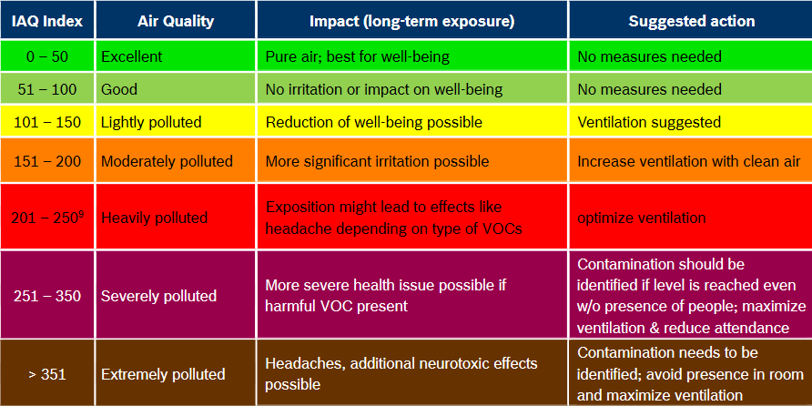

# CO2Warner

## Sensors

### Bosch gas sensor BME680

The BME sensor measures:
* Temperatue
* Humidity
* Barometric pressure
* Gas: Volatile Organic Compounds (VOC) like ethanol and CO (carbon monoxid)

There is a library for the Arduino, [BSEC: Bosch Software Environmental Cluster](https://github.com/BoschSensortec/BSEC-Arduino-library). The software allows the reading of the sensor values and provides an algorithm generation an index for air quality (IAQ).
The following diagram is from the [datasheed](https://www.bosch-sensortec.com/media/boschsensortec/downloads/datasheets/bst-bme680-ds001.pdf) and describes the IAQ value.

### Sensirion SCD30

The SCD30 sensor measures:
* Temperatue
* Humidity
* CO₂ (carbon dioxide)

Sparkfun has a [library](https://github.com/sparkfun/SparkFun_SCD30_Arduino_Library) for reading the SCD30 sensor data.

## Displaying data

## Links
[COVID-19 Prävention: CO2-Messung und bedarfsorientierte Lüftung](https://www.umwelt-campus.de/forschung/projekte/iot-werkstatt/ideen-zur-corona-krise)

[Der CO₂-Warner für die Schule](https://www.heise.de/select/make/2020/5/2022015381334973804)

[BME680](https://www.bosch-sensortec.com/products/environmental-sensors/gas-sensors-bme680/)

[BSEC Arduino Library](https://github.com/BoschSensortec/BSEC-Arduino-library)

[SCD30](https://www.sensirion.com/de/umweltsensoren/kohlendioxidsensor/kohlendioxidsensoren-co2/)

[SparkFun SCD30 CO₂ Sensor Library](https://github.com/sparkfun/SparkFun_SCD30_Arduino_Library)
